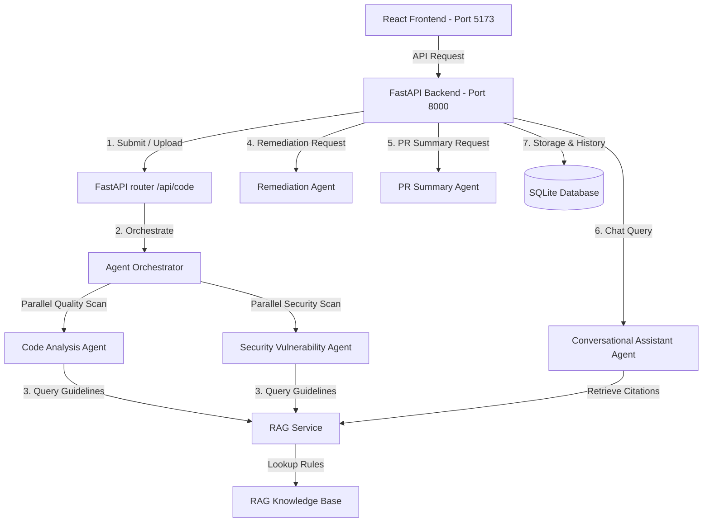

# 🛡️ Smart Code Inspection Platform with Vulnerability Detection System

An AI-powered multi-agent platform for automated code review, security vulnerability scanning (OWASP Top 10), RAG-driven remediation guidance, PR summary generation, and interactive conversational code assistance.

---

## 🚀 Key Features

### 1. 📝 Code Submission & Multi-Language Support
* **Dual Input Modes**: Direct copy-paste code editor with line numbering and multi-file upload supporting `.py`, `.java`, `.js`, `.ts`, `.cpp`, `.go`, and `.html`.
* **Syntax & AST Validation**: Automated syntax check before running inspection pipelines.

### 2. 🤖 Multi-Agent Inspection Pipeline (5 Core Agents)
* **Code Analysis Agent**: Evaluates structural metrics (parameters count, function length, docstring coverage) and cognitive code complexity.
* **Security Vulnerability Agent**: Scans for OWASP Top 10 vulnerabilities (SQL Injection, Command Injection, XSS, insecure deserialization, hardcoded secrets, weak hashing).
* **Remediation Agent**: Generates finding-specific security and code quality remediations, providing before/after corrected code snippets, explanations, and refactoring suggestions. Powered by Gemini LLM with instant deterministic RAG fallbacks.
* **PR Summary Agent**: Compiles findings into a structured, PR-style review summary with executive overview, severity breakdown, Code Health Score (0–100), prioritized fix roadmap, and 1-click GitHub markdown export.
* **Conversational Code Assistant Agent**: RAG-grounded Q&A interface for follow-up queries, vulnerability explanations, and secure coding guidance with cited source documents.
* **Multi-Agent Orchestrator**: Concurrently executes analysis and security agents using `asyncio.gather` and merges findings into a unified prioritized list.

### 3. 📚 RAG Secure Coding Knowledge Base & Storage
* **Retrieval-Augmented Generation (RAG)**: Uses TF-IDF vectorization and Cosine Similarity to ground LLM responses in OWASP secure coding standards.
* **Persistent SQLite Storage**: Local SQLite database storing analysis history, findings, remediations, and PR summaries.

### 4. 📊 Modern Developer Portal & Dashboard
* **Dashboard Analytics**: Metrics overview showing recent inspection scores, LOC scanned, and class counts.
* **Interactive Result Portal**: Category filtering (All, Code Quality, Security), severity badges (Critical, High, Medium, Low), interactive AI remediation drawer, and exportable PR summaries.

---

## 🏗️ System Architecture



---

## 🛠️ Tech Stack

* **Frontend**: React 18, Vite, Tailwind CSS, Lucide React Icons, React Simple Code Editor, PrismJS
* **Backend**: FastAPI, Uvicorn (ASGI), Pydantic v2, Scikit-Learn (TF-IDF Vectorization), NumPy, SQLite, Google GenAI SDK
* **Testing**: Automated Python validation scripts (`test_milestone2.py`, `test_milestone3.py`, `test_remediation.py`)

---

## 📁 Repository Structure

```text
├── infy/
│   ├── BackEnd/
│   │   ├── app/
│   │   │   ├── api/          # API routers (/code, /analysis, /remediation, /summary, /assistant)
│   │   │   ├── core/         # Config, settings, and RAG knowledge documents
│   │   │   ├── schemas/      # Pydantic schemas (code, analysis, remediation, summary, assistant)
│   │   │   ├── services/     # Core services and multi-agent pipeline
│   │   │   │   ├── agents/   # CodeAnalysis, Security, Remediation, PRSummary, Assistant
│   │   │   │   ├── agent_orchestrator.py
│   │   │   │   ├── code_validator.py
│   │   │   │   ├── rag_service.py
│   │   │   │   └── storage_service.py
│   │   │   └── main.py       # FastAPI application entrypoint
│   │   ├── data/             # Local SQLite database (analyses.db)
│   │   ├── test_milestone2.py# Vulnerability detection validation suite
│   │   ├── test_milestone3.py# Multi-agent validation suite
│   │   └── test_remediation.py# Remediation agent test script
│   └── FrontEnd/
│       ├── src/
│       │   ├── components/   # UI components (CodeEditor, Upload, ResultCard, ConversationalAssistant, Navbar)
│       │   ├── pages/        # Main pages (CodeReview, Dashboard)
│       │   └── services/     # API request handlers (api.js)
│       ├── package.json
│       └── vite.config.js
├── LICENSE                   # License file
├── README.md                 # Project overview and setup instructions
└── projectguide.md           # Developer guide and system architecture docs
```

---

## 💻 Installation & Quickstart

### Prerequisites
* **Node.js**: v18.0.0 or higher
* **Python**: v3.9 or higher

---

### Step 1: Backend Setup

1. **Navigate to the Backend directory**:
   ```bash
   cd infy/BackEnd
   ```

2. **Create and activate a virtual environment** (optional but recommended):
   ```bash
   python -m venv venv
   # On Windows:
   venv\Scripts\activate
   # On macOS/Linux:
   source venv/bin/activate
   ```

3. **Install dependencies**:
   ```bash
   pip install fastapi uvicorn pydantic scikit-learn numpy javalang google-genai python-dotenv
   ```

4. **Start the FastAPI server**:
   ```bash
   python -m uvicorn app.main:app --port 8000
   ```
   *Interactive API docs available at: `http://localhost:8000/docs`*

---

### Step 2: Run Backend Validation Tests

Execute the test suites from `infy/BackEnd`:

```bash
# Test vulnerability detection agents
python test_milestone2.py

# Test multi-agent pipeline (Remediation, PR Summary, Conversational Assistant)
python test_milestone3.py

# Test remediation generation
python test_remediation.py
```

---

### Step 3: Frontend Setup

1. **Navigate to the Frontend directory**:
   ```bash
   cd infy/FrontEnd
   ```

2. **Configure Environment Variables** (create `.env` in `infy/FrontEnd`):
   ```env
   VITE_API_BASE_URL=http://localhost:8000
   ```

3. **Install dependencies**:
   ```bash
   npm install
   ```

4. **Start the development server**:
   ```bash
   npm run dev
   ```
   *Web application accessible at: `http://localhost:5173/`*

---

## 🔍 API Endpoints Summary

| Method | Endpoint | Description |
| :--- | :--- | :--- |
| `POST` | `/api/code/submit` | Submit code snippet for analysis |
| `POST` | `/api/code/upload` | Upload source file for analysis |
| `GET` | `/api/analysis` | List all historical code inspection records |
| `GET` | `/api/analysis/{analysis_id}` | Retrieve detailed findings by inspection ID |
| `DELETE` | `/api/analysis/{analysis_id}` | Purge inspection record by ID |
| `POST` | `/api/remediation/{analysis_id}` | Generate AI/RAG remediation for findings |
| `GET` | `/api/summary/{analysis_id}` | Generate PR-style review summary & Health Score |
| `POST` | `/api/assistant/chat` | Q&A with RAG-grounded Conversational Code Assistant |