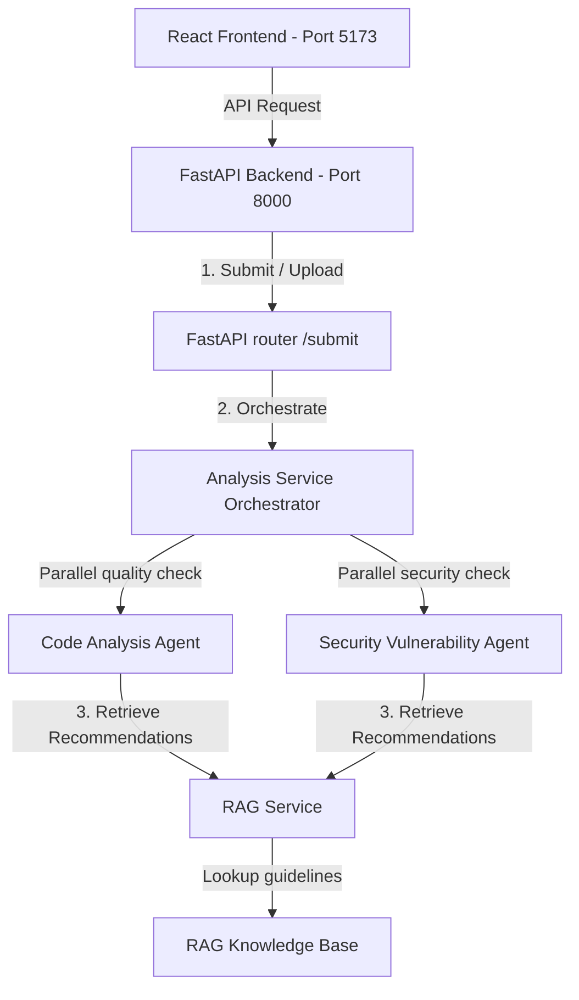

# Milestone 2 Completion Details & System Architecture

This document details the completed components under **Milestone 2** of the **Smart Code Inspection Platform with Vulnerability Detection System**.

---

## 🏗️ System Architecture



### 1. Code Submission & UI Module
* **Frontend Components**:
  * `Dashboard.jsx`: Analytics overview showing recent code inspection scores, metrics (LOC, classes count), and quick navigation action items.
  * `Navbar.jsx`: Central header directing pages navigation routes.
  * `CodeReview.jsx` & `CodeEditor.jsx`: Simple code editor supporting raw copy-pasting, custom theme styling, syntax coloring, and live line numbering. Also displays dynamic filenames inside tabs.
  * `FileUpload.jsx`: File upload supporting code source extensions (`.py`, `.java`, `.js`, `.ts`, `.cpp`, `.go`, `.html`). Triggers active API file upload call on load.
  * `AnalysisProgress.jsx`: Multi-stage active loading visualizer reporting current agent state.
* **API Connection**:
  * Calls `POST /api/code/submit` for direct submissions.
  * Calls `POST /api/code/upload` for file uploads.

### 2. Multi-Agent Analysis Pipeline
* **Code Analysis Agent**: Evaluates structural metrics (parameters count, function length, docstring coverage) and cognitive code complexity.
* **Security Vulnerability Agent**: Scans for OWASP Top 10 vulnerabilities (SQLi, Command Injection, XSS, insecure deserialization, hardcoded secrets, weak hashing). Uses robust AST-based validation for Python (built-in AST library) and Java (`javalang` package).
* **Parallel Orchestration**: Concurrently runs quality and security checks using Python `asyncio` parallel tasks, then merges and deduplicates code smells and security warnings.
* **RAG Context Pipeline**: Uses a local `scikit-learn` TF-IDF Vectorizer and `cosine_similarity` to retrieve context recommendations from the indexed RAG Knowledge Base (`rag_kb.py`).

---

## 🛠️ Installation & Setup Commands

To set up the platform on your local machine, run the following command sequence:

### 1. Backend Server Setup
```bash
# Navigate to Backend folder
cd infy/BackEnd

# Install required dependencies
pip install fastapi uvicorn pydantic scikit-learn numpy javalang

# Start the server
python -m uvicorn app.main:app --port 8000
```
*API Swagger interactive documentation is available at `http://127.0.0.1:8000/docs`.*

### 2. Run Validation Tests
```bash
# Navigate to Backend folder
cd infy/BackEnd

# Execute automated tests
python test_milestone2.py
```

### 3. Frontend Portal Setup
```bash
# Navigate to Frontend folder
cd infy/FrontEnd

# Install package dependencies
npm install

# Start development site
npm run dev
```
*The web interface will be accessible at: `http://localhost:5173/`.*
