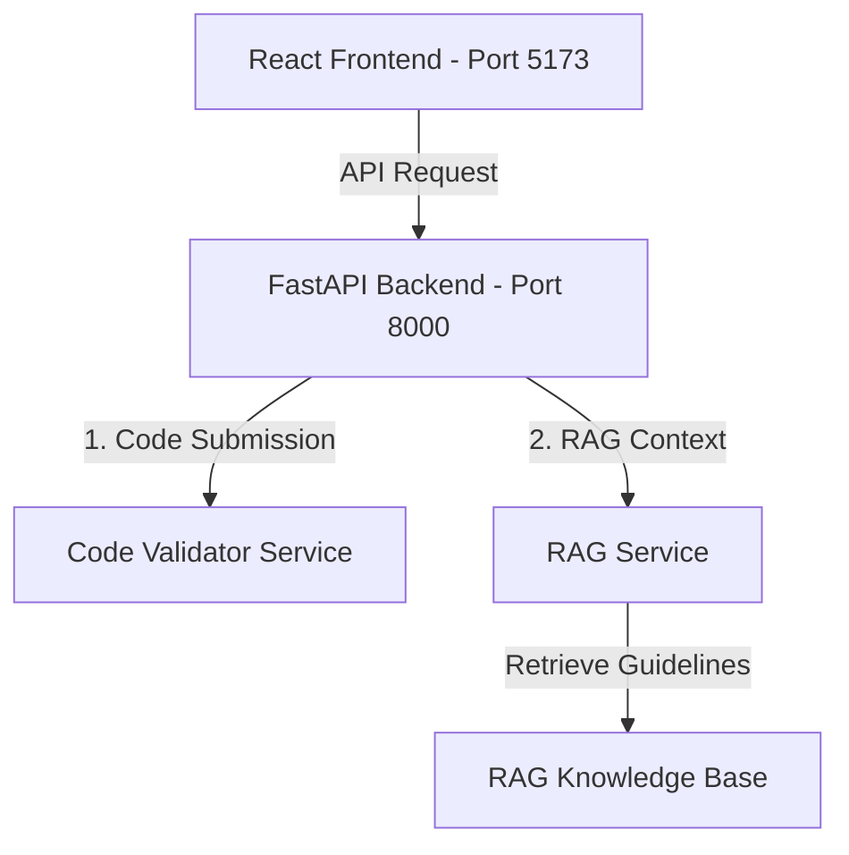

# Milestone 1 Completion Details & System Architecture

This document details the completed components under **Milestone 1** of the **Smart Code Inspection Platform with Vulnerability Detection System**.

---

## 🏗️ System Architecture



### 1. Code Submission Module
* **Frontend Components**:
  * `CodeEditor.jsx`: Integrated simple code editor supporting raw copy-pasting, custom theme styles, syntax coloring options, and line numbering.
  * `FileUpload.jsx`: Implemented drag-and-drop file selector supporting custom code extensions (`.py`, `.java`, `.js`, `.ts`, `.cpp`, `.go`, `.html`).
  * `LanguageSelector.jsx`: Dropdown control specifying the code context for validation.
* **API Connection**:
  * Calls `POST /api/code/submit` for direct submissions.
  * Calls `POST /api/code/upload` for file uploads.

### 2. Syntax Validation Engine
* Located at `BackEnd/app/services/code_validator.py`.
* **Python**: Parses code to Abstract Syntax Tree (AST) node representations using python standard `ast.parse`.
* **Java**: Utilizes tokenizing and parsing library `javalang`. Features a robust snippet wrapper (`_validate_java_snippet`) allowing developers to test partial blocks or single Java methods without requiring full class structures.
* **Brackets / Quotes Balancer**: Fallback parser validating matched bracket pairs `()`, `[]`, `{}`, and checking for unterminated string literals in dynamically typed languages.

### 3. RAG Knowledge Base & Context Pipeline
* **Knowledge Index**: Contained within `BackEnd/app/core/rag_kb.py`, indexing detailed secure coding practices mapped to OWASP categories (SQLi, Command Injection, XSS, CSRF, Cryptographic Failures, etc.).
* **Search Mechanics**: Configured in `BackEnd/app/services/rag_service.py`. Standardizes text inputs, breaks documents down into paragraph-sized chunks, and uses `scikit-learn`'s `TfidfVectorizer` alongside `cosine_similarity` to retrieve context recommendations.

---

## 🛠️ Installation & Setup Commands

To set up the platform on your local machine, run the following command sequence:

### 1. Backend Server Setup
```bash
# Navigate to Backend folder
cd infy/BackEnd

# Install required dependencies
pip install fastapi uvicorn pydantic scikit-learn numpy javalang

# Start the server
python -m uvicorn app.main:app --port 8000
```

### 2. Frontend Portal Setup
```bash
# Navigate to Frontend folder
cd infy/FrontEnd

# Install package dependencies
npm install

# Start development site
npm run dev
```
*Make sure to verify that the `.env` file containing `VITE_API_BASE_URL=http://localhost:8000` exists in the `FrontEnd` directory.*
