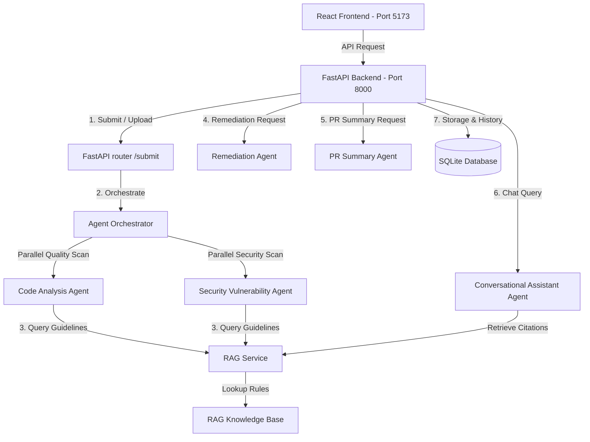

# Project Guide: Smart Code Inspection Platform with Vulnerability Detection System

This document provides a comprehensive overview of the system architecture, directory structures, functional modules, and installation guidelines for developers working on this project.

---

## 🏗️ System Architecture



### 1. Code Submission & Developer Portal Module
* **Frontend Components**:
  * `Dashboard.jsx`: Analytics overview showing recent code inspection scores, metrics (LOC, classes count), and quick navigation action items.
  * `Navbar.jsx`: Central header directing navigation between Dashboard, Analyze, and History views.
  * `CodeReview.jsx` & `CodeEditor.jsx`: Simple code editor supporting raw copy-pasting, custom theme styling, syntax coloring, and live line numbering.
  * `FileUpload.jsx`: File upload supporting code source extensions (`.py`, `.java`, `.js`, `.ts`, `.cpp`, `.go`, `.html`).
  * `AnalysisProgress.jsx`: Multi-stage active loading visualizer reporting current agent state.
  * `ResultCard.jsx`: Comprehensive findings display with severity badges, category filter tabs (All, Code Quality, Security), the interactive **Generate AI Remediation** view, and **PR Review Summary** card with 1-click GitHub markdown export.
  * `ConversationalAssistant.jsx`: Interactive slide-out chat drawer providing developer Q&A grounded in the RAG Secure Coding knowledge base with citation previews.
* **API Connection**:
  * Calls `POST /api/code/submit` for direct submissions.
  * Calls `POST /api/code/upload` for file uploads.
  * Calls `POST /api/remediation/{analysis_id}` to generate AI-powered secure code fixes.
  * Calls `GET /api/summary/{analysis_id}` to compile structured PR review summaries.
  * Calls `POST /api/assistant/chat` for conversational Q&A.
  * Calls `GET /api/analysis` to retrieve analysis history records.
  * Calls `DELETE /api/analysis/{analysis_id}` to purge history records.

### 2. Multi-Agent Analysis & Remediation Pipeline (5 Core Agents)
1. **Code Analysis Agent** (`code_analysis_agent.py`): Evaluates structural metrics (parameters count, function length, docstring coverage) and cognitive code complexity.
2. **Security Vulnerability Agent** (`security_vulnerability_agent.py`): Scans for OWASP Top 10 vulnerabilities (SQLi, Command Injection, XSS, insecure deserialization, hardcoded secrets, weak hashing).
3. **Remediation Agent** (`remediation_agent.py`): Generates finding-specific security and code quality fixes with side-by-side corrected code snippets, explanations, and refactoring tips. Backed by Gemini LLM with instant deterministic RAG fallback.
4. **PR Summary Agent** (`pr_summary_agent.py`): Compiles all agent findings into a structured, PR-style review summary with executive overview, severity breakdown, Code Health Score (0-100), prioritized fix roadmap, and GitHub-ready markdown.
5. **Conversational Code Assistant Agent** (`assistant_agent.py`): RAG-powered Q&A grounded in secure coding knowledge base for follow-up queries, vulnerability explanations, and deeper guidance.
* **Agent Orchestrator** (`agent_orchestrator.py`): Executes quality and security agents concurrently using `asyncio.gather` and deduplicates results.
* **Persistent SQLite Storage** (`storage_service.py`): Automatically stores analyses and remediations in a local SQLite database (`data/analyses.db`).
* **RAG Context Pipeline** (`rag_service.py`): Uses TF-IDF Vectorization and cosine similarity to retrieve context recommendations from the indexed RAG Knowledge Base (`rag_kb.py`).

---

## 📁 Repository Directory Structure

```text
├── infy/
│   ├── BackEnd/
│   │   ├── app/
│   │   │   ├── api/          # API routers (/code, /analysis, /remediation, /summary, /assistant)
│   │   │   ├── core/         # Settings, config, and RAG knowledge documents
│   │   │   ├── schemas/      # Pydantic schemas (code, analysis, remediation, summary, assistant)
│   │   │   ├── services/     # Core services and multi-agent pipeline
│   │   │   │   ├── agents/   # CodeAnalysis, Security, Remediation, PRSummary, Assistant
│   │   │   │   ├── agent_orchestrator.py
│   │   │   │   ├── code_validator.py
│   │   │   │   ├── rag_service.py
│   │   │   │   └── storage_service.py
│   │   │   └── main.py       # FastAPI application entrypoint
│   │   ├── data/             # Local SQLite database (analyses.db)
│   │   ├── test_milestone2.py # Automated detection validation suite
│   │   ├── test_milestone3.py # Multi-agent suite validation (Remediation, PR Summary, Chat)
│   │   ├── test_remediation.py# Remediation agent validation script
│   │   └── README.md
│   └── FrontEnd/
│       ├── src/
│       │   ├── components/   # UI (Editor, Upload, ResultCard, Navbar, Progress, ConversationalAssistant)
│       │   ├── pages/        # Page views (CodeReview, Dashboard)
│       │   ├── services/     # API request handlers (api.js)
│       │   └── types/        # Type configurations and defaults
│       ├── package.json
│       ├── vite.config.js
│       └── README.md
├── LICENSE                   # Open-source LICENSE placeholder
├── README.md                 # Main user instructions
└── projectguide.md           # This developer guide
```

---

## 🛠️ Installation & Setup Commands

To set up the platform on your local machine, run the following command sequence:

### 1. Backend Server Setup
```bash
# Navigate to Backend folder
cd infy/BackEnd

# Install required dependencies
pip install fastapi uvicorn pydantic scikit-learn numpy javalang google-genai python-dotenv

# Start the server
python -m uvicorn app.main:app --port 8000
```
*API Swagger interactive documentation is available at `http://127.0.0.1:8000/docs`.*

### 2. Run Validation Tests
```bash
# Navigate to Backend folder
cd infy/BackEnd

# Execute automated tests
python test_milestone2.py
python test_milestone3.py
python test_remediation.py
```

### 3. Frontend Portal Setup
```bash
# Navigate to Frontend folder
cd infy/FrontEnd

# Install package dependencies
npm install

# Start development site
npm run dev
```
*The web interface will be accessible at: `http://localhost:5173/`.*

---

## 🔍 API Endpoints Reference

### Code Validation & Analysis Endpoints
* **`POST /api/code/submit`**: Submit code snippet as a JSON request body.
* **`POST /api/code/upload`**: Upload code file as form-data.
* **`GET /api/analysis`**: List historical code analysis records.
* **`GET /api/analysis/{analysis_id}`**: Fetch detailed code analysis report by ID.
* **`DELETE /api/analysis/{analysis_id}`**: Delete an analysis record.
* **`POST /api/remediation/{analysis_id}`**: Generate or retrieve AI-powered remediations with corrected code.
* **`GET /api/summary/{analysis_id}`**: Generate structured Pull Request review summary with Health Score.
* **`POST /api/assistant/chat`**: Conversational Code Assistant Q&A grounded in RAG knowledge base.
